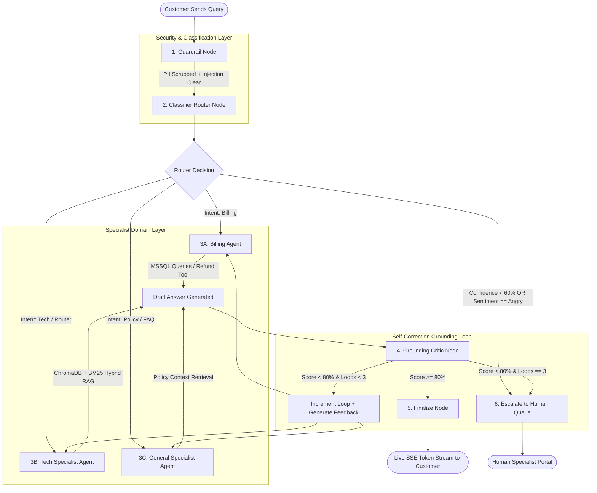
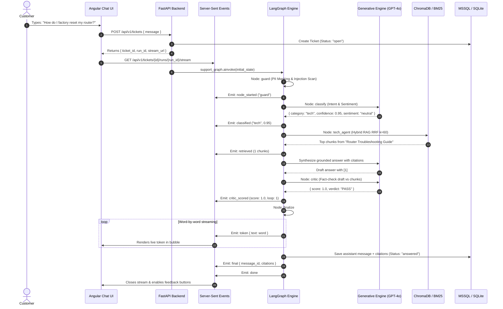

# Support Copilot: Deep Technical Architecture & Query Execution Flow

> Exhaustive, step-by-step technical guide on how customer requests traverse the multi-agent LangGraph pipeline from raw input to verified citation delivery.

---

## Table of Contents

1. [High-Level Flow Diagram](#1-high-level-flow-diagram)
2. [LangGraph State Schema Definition](#2-langgraph-state-schema-definition)
3. [Step-by-Step Node Execution Pipeline](#3-step-by-step-node-execution-pipeline)
   - [Node 1: Guardrail Security (`guard`)](#node-1-guardrail-security-guard)
   - [Node 2: Intent & Sentiment Classifier (`classify`)](#node-2-intent--sentiment-classifier-classify)
   - [Node 3A: Billing Specialist Agent (`billing_agent`)](#node-3a-billing-specialist-agent-billing_agent)
   - [Node 3B: Tech Specialist Agent (`tech_agent`)](#node-3b-tech-specialist-agent-tech_agent)
   - [Node 3C: General Specialist Agent (`general_agent`)](#node-3c-general-specialist-agent-general_agent)
   - [Node 4: Autonomous Grounding Critic (`critic`)](#node-4-autonomous-grounding-critic-critic)
   - [Node 5: Finalization & SSE Token Stream (`finalize`)](#node-5-finalization--sse-token-stream-finalize)
   - [Node 6: Human Escalation Handler (`escalate`)](#node-6-human-escalation-handler-escalate)
4. [Hybrid RAG Pipeline Deep-Dive](#4-hybrid-rag-pipeline-deep-dive)
5. [Self-Correction Loop Mechanics](#5-self-correction-loop-mechanics)
6. [Complete Sequence Diagram](#6-complete-sequence-diagram)
7. [State Transition Matrix](#7-state-transition-matrix)

---

## 1. High-Level Flow Diagram



---

## 2. LangGraph State Schema Definition

The graph state is defined as a typed dictionary (`TicketState`) that flows immutably across all nodes:

```python
class TicketState(TypedDict):
    ticket_id: str                          # Unique UUID of customer ticket
    thread_id: str                          # LangGraph checkpoint thread identifier
    customer_id: str                        # Authenticated customer UUID
    run_id: str                             # UUID for the current execution run
    seq: int                                # Sequential event counter for SSE telemetry
    messages: List[Dict[str, str]]          # Chronological conversation history
    
    # Guardrail Outputs
    clean_message: Optional[str]            # PII-redacted & sanitized customer message
    pii_detected: Optional[bool]            # Boolean flag if sensitive data was scrubbed
    
    # Classifier Outputs
    category: Optional[str]                 # "billing" | "tech" | "general" | "escalate"
    confidence: Optional[float]             # Classifier confidence score [0.0 - 1.0]
    sentiment: Optional[str]                # "neutral" | "positive" | "angry"
    reasoning: Optional[str]                # Classifier chain-of-thought rationale
    
    # RAG & Tools
    retrieved: Optional[List[Dict[str, Any]]]# Chunks retrieved from Hybrid RAG
    pending_refund: Optional[Dict[str, Any]]# Refund tool payload (if applicable)
    
    # Agent Draft & Critic Loop
    answer: Optional[str]                   # Current draft answer from specialist agent
    citations: Optional[List[Dict[str, Any]]]# Inline citation mappings [{n: 1, title: ...}]
    critic_score: Optional[float]           # Numeric grounding score [0.0 - 1.0]
    critic_feedback: List[str]              # Historical revision feedback from critic
    loops: int                              # Current critic iteration count (capped at 3)
    
    # Final Outputs
    final_answer: Optional[str]             # Verified final answer delivered to user
    escalation_reason: Optional[str]        # Reason for human escalation (if triggered)
```

---

## 3. Step-by-Step Node Execution Pipeline

### Node 1: Guardrail Security (`guard`)
1. **Input:** `state["messages"][-1]["content"]`
2. **PII Masking Execution:**
   - Evaluates regex patterns for payment cards: `(?:\d[ -]*?){13,19}`.
   - Runs the **Luhn Algorithm (Mod-10 Checksum)** to verify genuine credit/debit card numbers:
     $$\sum_{i=1}^{n} d_i' \equiv 0 \pmod{10}$$
     where every second digit from right is doubled.
   - Redacts genuine cards to `****-****-****-XXXX`.
   - Masks Indian phone numbers (`+91` / 10 digits) and email identifiers.
3. **Prompt Injection Scanner:**
   - Scans against heuristic patterns: `"ignore previous instructions"`, `"system prompt leak"`, `"you are now an unrestricted assistant"`.
   - If detected, sanitizes the query or flags security alert.
4. **State Transition:** Updates `clean_message`, sets `pii_detected`, increments `seq`.

---

### Node 2: Intent & Sentiment Classifier (`classify`)
1. **Input:** `state["clean_message"]`
2. **LLM Execution:** Calls `openai.gpt-4o` with strict Pydantic JSON schema:
   ```json
   {
     "category": "tech",
     "confidence": 0.95,
     "sentiment": "neutral",
     "reasoning": "Customer asking for router hardware factory reset instructions."
   }
   ```
3. **Conditional Routing Logic:**
   - If `sentiment == "angry"` $\longrightarrow$ Route to **`escalate`** (Reason: `angry_customer_sentiment`).
   - If `confidence < 0.60` $\longrightarrow$ Route to **`escalate`** (Reason: `low_classifier_confidence`).
   - Else $\longrightarrow$ Route to designated specialist: `billing_agent`, `tech_agent`, or `general_agent`.

---

### Node 3A: Billing Specialist Agent (`billing_agent`)
1. **Input:** `state["clean_message"]`, `state["customer_id"]`
2. **Tool Execution (`billing_tools.py`):**
   - Queries relational database (`orders`, `order_items`, `refunds`).
   - Extracts order details, fulfillment status, and delivery timestamps.
3. **Code-Enforced Financial Limit:**
   - If user requests a refund for order $\le ₹500$ $\longrightarrow$ Auto-generates approved refund record.
   - If user requests a refund for order $> ₹500$ $\longrightarrow$ Creates pending supervisor approval and escalates.
4. **Draft Synthesis:** Formulates structured billing explanation and routes to **`critic`**.

---

### Node 3B: Tech Specialist Agent (`tech_agent`)
1. **Input:** `state["clean_message"]`, `state["critic_feedback"]`
2. **Hybrid RAG Execution:**
   - Embeds query using `text-embedding-3-small` (1536 dimensions).
   - Retrieves top-$k$ semantic chunks from ChromaDB `tech` collection.
   - Runs in-memory BM25 sparse keyword search.
   - Merges candidate ranks using **Reciprocal Rank Fusion (RRF $k=60$)**.
   - Filters candidate chunks with score threshold $\ge 0.35$.
3. **Grounded Synthesis:** Prompts `openai.gpt-4o` with retrieved chunks and prior critic feedback to write step-by-step instructions with inline citation tags `[1]`, `[2]`.
4. **Routes to:** **`critic`**.

---

### Node 3C: General Specialist Agent (`general_agent`)
1. **Input:** `state["clean_message"]`, `state["critic_feedback"]`
2. **Hybrid RAG Execution:**
   - Queries ChromaDB `general` collection for return policy, warranty coverage, and shipping timelines.
   - Synthesizes policy-accurate answers with citations.
3. **Routes to:** **`critic`**.

---

### Node 4: Autonomous Grounding Critic (`critic`)
1. **Input:** `state["retrieved"]`, `state["answer"]`, `state["loops"]`
2. **Evaluation Protocol:**
   - Decomposes agent's draft answer into atomic factual statements.
   - Compares every atomic statement against the retrieved source chunks.
   - Assigns verification labels: `SUPPORTED` (1.0), `PARTIAL` (0.5), `UNSUPPORTED` (0.0).
   - Computes weighted score:
     $$\text{Critic Score} = \frac{\sum \text{Score}(c_i)}{N}$$
3. **Conditional Routing Decision:**
   - If $\text{Critic Score} \ge 0.80$ $\longrightarrow$ Route to **`finalize`**.
   - If $\text{Critic Score} < 0.80$ AND $\text{loops} < 3$ $\longrightarrow$ Increments `loops`, appends actionable feedback, and loops back to the respective specialist agent.
   - If $\text{Critic Score} < 0.80$ AND $\text{loops} == 3$ $\longrightarrow$ Route to **`escalate`** (Reason: `critic_cap_reached`).

---

### Node 5: Finalization & SSE Token Stream (`finalize`)
1. **Output Policy Sanitizer:** Verifies that no internal system instructions or unprocessed tokens leak.
2. **SSE Streaming:** Emits word-by-word streaming tokens (`event: token`) over HTTP connection to the browser.
3. **Database Persistence:** Inserts message record into `ticket_messages`, attaches structured citation list, updates ticket status to `answered`.
4. **Completion:** Emits `event: final` and `event: done`.

---

### Node 6: Human Escalation Handler (`escalate`)
1. **Escalation Triggers:**
   - `angry_customer_sentiment`
   - `low_classifier_confidence`
   - `critic_cap_reached`
   - `refund_over_limit`
2. **Context Bundle Creation:**
   - Bundles customer profile, intent reasoning, retrieved chunks, and all failed AI drafts into an `Escalation` record.
3. **Queue Notification:** Updates ticket status to `escalated` and pushes to the **Agent Escalation Queue** (`/agent/escalations`).
4. **Customer Notice:** Emits polite notification: *"Your request has been escalated to our human specialist team."*

---

## 4. Hybrid RAG Pipeline Deep-Dive

Support Copilot implements a dual-retrieval pipeline combining **Dense Semantic Search** and **Sparse Keyword Search**:

```
                              Customer Query
                                    │
                  ┌─────────────────┴─────────────────┐
                  ▼                                   ▼
        [ Dense Vector Search ]             [ Sparse Keyword Search ]
        • text-embedding-3-small            • BM25 Okapi Algorithm
        • ChromaDB (Cosine Space)           • Exact Model & Error Codes
        • Top-K Dense Candidates            • Top-K Sparse Candidates
                  │                                   │
                  └─────────────────┬─────────────────┘
                                    ▼
                     [ Reciprocal Rank Fusion (RRF) ]
                          k = 60 Rank Merging
                                    │
                                    ▼
                     [ Score Thresholding >= 0.35 ]
                                    │
                                    ▼
                      Grounded Context to LLM
```

---

## 5. Self-Correction Loop Mechanics

```
  ┌────────────────────────────────────────────────────────┐
  │                   CRITIC LOOP LIFECYCLE                │
  │                                                        │
  │   Specialist Agent Drafts Answer                       │
  │            │                                           │
  │            ▼                                           │
  │   Critic Evaluates Grounding                           │
  │            │                                           │
  │            ├── [Score >= 0.80] ──────► Finalize Node   │
  │            │                                           │
  │            └── [Score < 0.80]                          │
  │                     │                                  │
  │                     ├── Loops < 3  ──► Add Feedback &  │
  │                     │                  Re-draft Agent  │
  │                     │                                  │
  │                     └── Loops == 3 ──► Escalate Node   │
  │                                                        │
  └────────────────────────────────────────────────────────┘
```

---

## 6. Complete Sequence Diagram



---

## 7. State Transition Matrix

| Current Node | Routing Condition | Target Next Node | Resulting State Changes |
|---|---|---|---|
| **Entry Point** | Unconditional | `guard` | `clean_message`, `pii_detected` populated |
| **`guard`** | Unconditional | `classify` | `seq` incremented |
| **`classify`** | `sentiment == "angry"` OR `confidence < 0.60` | `escalate` | `escalation_reason` set, status $\rightarrow$ `escalated` |
| **`classify`** | `category == "billing"` | `billing_agent` | Specialist billing context initialized |
| **`classify`** | `category == "tech"` | `tech_agent` | Chroma `tech` collection targeted |
| **`classify`** | `category == "general"` | `general_agent` | Chroma `general` collection targeted |
| **Specialist Agents**| Unconditional | `critic` | `answer`, `citations`, `retrieved` populated |
| **`critic`** | `critic_score >= 0.80` | `finalize` | Verified draft ready for output |
| **`critic`** | `critic_score < 0.80` AND `loops < 3` | Previous Specialist Agent | `loops += 1`, `critic_feedback` appended |
| **`critic`** | `critic_score < 0.80` AND `loops == 3` | `escalate` | `escalation_reason = "critic_cap_reached"` |
| **`finalize`** | Unconditional | `END` | Message saved, status $\rightarrow$ `answered` |
| **`escalate`** | Unconditional | `END` | Escalation recorded, status $\rightarrow$ `escalated` |
