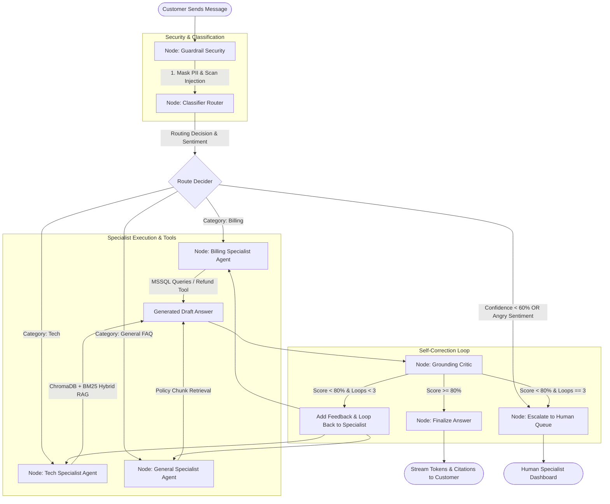

# Support Copilot: End-to-End Architecture & Query Execution Flow

> Detailed technical walkthrough of how a customer message travels through the multi-agent graph from ingestion to final delivery.

---

## 1. High-Level Architecture Flowchart



---

## 2. Step-by-Step Execution Lifecycle

### Step 1: Input Ingestion & Guardrail Node (`guard`)
1. **PII Masking:**
   - Detects 13-19 digit payment cards using Regular Expressions and validates them using the **Luhn Algorithm**.
   - Valid cards are redacted to `****-****-****-1234` before reaching any LLM or database.
   - Masks Indian phone numbers (`+91` / 10 digits) and email identifiers.
2. **Prompt Injection Scanner:**
   - Checks for heuristic bypass patterns: `"ignore previous instructions"`, `"system prompt leak"`, `"you are now in unrestricted mode"`, markdown jailbreaks.
   - Flags suspicious payloads and sanitizes the prompt.

---

### Step 2: Intent & Sentiment Classification (`classify`)
- Uses `openai.gpt-4o` with structured JSON output schema:
  ```json
  {
    "category": "tech" | "billing" | "general" | "escalate",
    "confidence": 0.95,
    "sentiment": "neutral" | "positive" | "angry",
    "reasoning": "Customer is asking for manual hardware reset steps."
  }
  ```
- **Conditional Routing Rule:**
  - If `confidence < 0.60` OR `sentiment == "angry"` $\rightarrow$ Immediately route to `escalate_node`.
  - Otherwise, route to the specialist agent matching `category`.

---

### Step 3: Specialist Agent Execution

#### A. Billing Agent (`billing_agent`)
- **Data Access:** Relational Database (MSSQL / SQLite) for `orders`, `order_items`, `refunds`.
- **Permission Level:** Read + Limited Safe Write.
- **Refund Tool Rule:**
  - Automatically processes refunds if `order_amount <= ₹500`.
  - If `order_amount > ₹500`, triggers an escalation for human supervisor approval.

#### B. Tech Specialist Agent (`tech_agent`)
- **Data Access:** Technical KB chunks (Router manuals, connectivity troubleshooting, firmware).
- **RAG Pipeline:**
  1. Computes dense embedding with `text-embedding-3-small` (1536-d).
  2. Queries ChromaDB for top-$k$ cosine similarity chunks.
  3. Queries in-memory BM25 index for sparse keyword matching.
  4. Merges scores using **Reciprocal Rank Fusion (RRF)**:
     $$\text{RRF Score}(d) = \sum_{m \in \{\text{dense}, \text{sparse}\}} \frac{1}{60 + \text{rank}_m(d)}$$
  5. Selects top chunks above threshold ($\ge 0.35$).
  6. Synthesizes a grounded answer with inline citations `[1]`, `[2]`.

#### C. General Specialist Agent (`general_agent`)
- **Data Access:** General policy chunks (Returns & Refunds FAQ, Shipping timelines, Account policies).
- **RAG Pipeline:** Runs Hybrid RAG over general collection and drafts policy-compliant responses.

---

### Step 4: Autonomous Grounding Critic Loop (`critic`)
The Critic Node acts as an automated QA judge:
1. Receives:
   - Retrieved Source Chunks
   - Specialist Agent's Draft Answer
   - Prior Feedback History
2. Evaluates 2 Core Factors:
   - **Groundedness:** Are all factual claims directly supported by the retrieved context?
   - **Relevance:** Does the answer directly answer the customer's query?
3. Scores between `0.0` and `1.0`:
   - **Score $\ge 0.80$ (PASS):** Route to `finalize_node`.
   - **Score $< 0.80$ (FAIL & Loop $< 3$):** Generates actionable feedback (e.g. *"Claim about 30-day return not supported by chunk 2"*) and loops back to the specialist agent to re-draft.
   - **Score $< 0.80$ (FAIL & Loop $== 3$):** Safety cap reached; routes to `escalate_node` with the reason `"critic_cap_reached"`.

---

### Step 5: Finalization & Live Streaming (`finalize`)
1. **Policy Sanitizer:** Ensures no raw database error messages or internal system prompts leak.
2. **Token Streaming:** Emits word-by-word Server-Sent Events (`event: token`) over HTTP.
3. **Persists Record:** Saves the assistant response in `ticket_messages` and updates ticket status to `answered`.
4. **Emits Completion:** Emits `event: final` with structured citations and `event: done`.

---

### Step 6: Human Escalation Workflow (`escalate`)
1. Creates an `Escalation` database record containing:
   - Escalation Reason (`angry_customer_sentiment`, `low_classifier_confidence`, `critic_cap_reached`)
   - Complete context bundle: attempted drafts, retrieved chunks, classifier confidence, and conversation history.
2. Changes ticket status to `escalated`.
3. Displays the ticket on the **Support Agent Escalation Queue** (`/agent/escalations`), where a human agent can inspect the full AI trace and send a manual resolution.
