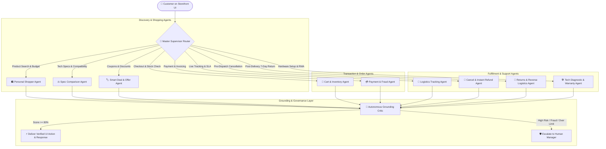
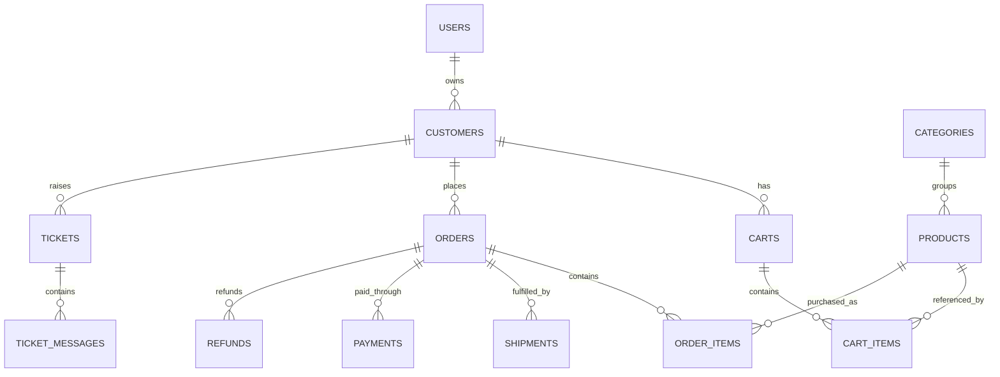

# 🛒 Enterprise E-Commerce & Multi-Agent Autonomous Platform: Complete Implementation Plan

> **Architectural Blueprint & End-to-End Implementation Roadmap for Transforming Support Copilot into a Production-Grade Autonomous E-Commerce Platform (Amazon / Flipkart Scale).**
>
> **Core Stack:** Python (FastAPI, LangGraph) · **Vector Database:** ChromaDB (Hybrid RAG) · **Relational Database:** Microsoft SQL Server (MSSQL) / SQLite · **Frontend:** Angular 17+ (Signals, Standalone) · **LLM Engine:** Capgemini Generative Engine (`openai.gpt-4o`, `text-embedding-3-small`).

---

## 📑 Table of Contents

1. [Executive Summary & Target Architecture](#1-executive-summary--target-architecture)
2. [Autonomous Multi-Agent Roster & Responsibilities](#2-autonomous-multi-agent-roster--responsibilities)
3. [Relational Database Schema & E-Commerce ERD](#3-relational-database-schema--e-commerce-erd)
4. [3-Collection Hybrid RAG & Grounding Critic Pipeline](#4-3-collection-hybrid-rag--grounding-critic-pipeline)
5. [E-Commerce API Contracts & Endpoints](#5-e-commerce-api-contracts--endpoints)
6. [Angular 17 Storefront & Copilot UI Architecture](#6-angular-17-storefront--copilot-ui-architecture)
7. [Step-by-Step Phased Implementation Roadmap](#7-step-by-step-phased-implementation-roadmap)
8. [Security, Financial Guardrails & Compliance](#8-security-financial-guardrails--compliance)
9. [Evaluation Benchmark & Testing Strategy](#9-evaluation-benchmark--testing-strategy)

---

## 1. Executive Summary & Target Architecture

### 🎯 Objective
Transform the existing customer support system into a **Full-Fledged Autonomous E-Commerce Shopping & Support Platform**. Customers can browse rich product catalogs, ask AI for personalized recommendations, compare technical specifications side-by-side, apply dynamic coupon codes, place orders, track live courier delivery checkpoints, and resolve post-purchase hardware issues via interactive diagnostic flows.



---

## 2. Autonomous Multi-Agent Roster & Responsibilities

```
┌────────────────────────────────────────────────────────────────────────────────────────────────────────┐
│                                    E-COMMERCE MULTI-AGENT ECOSYSTEM                                    │
├─────┬───────────────────────────┬───────────────────────────────────┬──────────────────────────────────┤
│ #   │ Agent Name                │ Primary Responsibility            │ Real-World Tools & Actions       │
├─────┼───────────────────────────┼───────────────────────────────────┼──────────────────────────────────┤
│ 1   │ 🛍️ Personal Shopper       │ Semantic product discovery,       │ • search_product_catalog()       │
│     │    Agent                  │ budget & room size matching.      │ • get_personalized_recommend()  │
├─────┼───────────────────────────┼───────────────────────────────────┼──────────────────────────────────┤
│ 2   │ ⚖️ Spec Comparison        │ Side-by-side spec comparison,     │ • compare_specifications()       │
│     │    Agent                  │ ISP compatibility verification.   │ • check_isp_compatibility()      │
├─────┼───────────────────────────┼───────────────────────────────────┼──────────────────────────────────┤
│ 3   │ 🏷️ Smart Deal & Offer     │ Dynamic coupon application,       │ • fetch_applicable_coupons()     │
│     │    Agent                  │ bank offers, bundle savings.      │ • apply_cart_discount()          │
├─────┼───────────────────────────┼───────────────────────────────────┼──────────────────────────────────┤
│ 4   │ 🛒 Cart & Inventory       │ Real-time stock reservation,      │ • check_pincode_service()        │
│     │    Agent                  │ pincode serviceability check.     │ • reserve_warehouse_stock()      │
├─────┼───────────────────────────┼───────────────────────────────────┼──────────────────────────────────┤
│ 5   │ 💳 Payment & Fraud        │ Secure payment processing (UPI,   │ • create_payment_intent()        │
│     │    Agent                  │ Cards, COD), double-debit refund. │ • reconcile_payment_status()     │
├─────┼───────────────────────────┼───────────────────────────────────┼──────────────────────────────────┤
│ 6   │ 🚚 Logistics Tracking     │ Live courier checkpoint tracking  │ • get_courier_telemetry()        │
│     │    Agent                  │ (BlueDart, Delhivery), ETA alerts.│ • reschedule_delivery_slot()     │
├─────┼───────────────────────────┼───────────────────────────────────┼──────────────────────────────────┤
│ 7   │ 🛑 Cancel & Refund        │ Pre-dispatch 100% instant cancel  │ • halt_warehouse_packing()       │
│     │    Agent                  │ and payment source refund.        │ • trigger_instant_refund()       │
├─────┼───────────────────────────┼───────────────────────────────────┼──────────────────────────────────┤
│ 8   │ 🔄 Returns & Reverse      │ 7-day post-delivery returns,      │ • validate_return_window()       │
│     │    Logistics Agent        │ doorstep pickup scheduling.       │ • schedule_doorstep_pickup()     │
├─────┼───────────────────────────┼───────────────────────────────────┼──────────────────────────────────┤
│ 9   │ 🛠️ Tech Diagnostic & RMA │ Interactive hardware diagnostics, │ • query_tech_manuals_rag()       │
│     │    Agent                  │ 1-Year brand warranty RMA claim.  │ • dispatch_warranty_rma()        │
├─────┼───────────────────────────┼───────────────────────────────────┼──────────────────────────────────┤
│ 10  │ 🧐 Autonomous Grounding   │ Verifies every claim against RAG, │ • score_atomic_claims()          │
│     │    Critic                 │ intercepts hallucinations.        │ • trigger_self_correction_loop() │
└─────┴───────────────────────────┴───────────────────────────────────┴──────────────────────────────────┘
```

---

## 3. Relational Database Schema & E-Commerce ERD



---

## 4. 3-Collection Hybrid RAG & Grounding Critic Pipeline

```
┌─────────────────────────────────────────────────────────────────────────────┐
│                       HYBRID RAG RETRIEVAL ENGINE                           │
├──────────────────┬─────────────────────────────┬────────────────────────────┤
│ Collection Name  │ Knowledge Base Content      │ Target Autonomous Agent    │
├──────────────────┼─────────────────────────────┼────────────────────────────┤
│ 1. products_kb   │ Product Catalog, Detailed   │ 🛍️ Personal Shopper Agent   │
│                  │ Specs, ISP Compatibility    │ ⚖️ Spec Comparison Agent   │
├──────────────────┼─────────────────────────────┼────────────────────────────┤
│ 2. tech_manuals  │ PDF Hardware Guides, LEDs,  │ 🛠️ Tech Diagnostic Agent   │
│                  │ IP Configs, Reset Timings   │ 🛡️ Warranty & RMA Agent    │
├──────────────────┼─────────────────────────────┼────────────────────────────┤
│ 3. policy_kb     │ 7-Day Return Policy, SLAs,  │ 📜 General Policy Agent    │
│                  │ Warranty Rules, Payment FAQ │ 🔄 Returns Logistics Agent │
└──────────────────┴─────────────────────────────┴────────────────────────────┘
```

---

## 5. E-Commerce API Contracts & Endpoints

### Storefront & Catalog APIs:
* `GET /api/v1/store/products` — List catalog with category filters, price range, and search query.
* `GET /api/v1/store/products/{slug}` — Full product details with specifications and stock count.
* `GET /api/v1/store/categories` — Product categories tree.

### Cart & Checkout APIs:
* `GET /api/v1/store/cart` — Get logged-in user cart items and computed discounts.
* `POST /api/v1/store/cart/items` — Add product to cart (`product_id`, `quantity`).
* `POST /api/v1/store/cart/apply-coupon` — Validate and apply coupon code.
* `POST /api/v1/store/checkout` — Convert cart to confirmed Order with live payment intent.

### Orders & Tracking APIs:
* `GET /api/v1/orders` — List customer active and historical orders.
* `GET /api/v1/orders/{order_id}` — Order details with live courier telemetry.
* `POST /api/v1/orders/{order_id}/cancel` — Pre-dispatch 1-click cancellation & instant refund.
* `POST /api/v1/orders/{order_id}/return` — 7-day return request with courier pickup booking.

---

## 6. Angular 17 Storefront & Copilot UI Architecture

```
┌─────────────────────────────────────────────────────────────────────────────┐
│                            STOREFRONT UI LAYOUT                             │
├─────────────────────────────────────────────────────────────────────────────┤
│ [Top Navbar] Logo | Search Bar 🔍 | Categories | 📦 Orders | 🛒 Cart (2)    │
├──────────────────────────────────────────────────────────────┬──────────────┤
│ 🛍️ Product Catalog Grid & Filters                            │ 🤖 AI COPILOT│
│ ┌──────────────────────┐  ┌──────────────────────┐           │ DRAWER       │
│ │ [Image]              │  │ [Image]              │           │ (Persistent  │
│ │ Mesh Router Pro      │  │ Wi-Fi Extender N300  │           │ Side-Pane)   │
│ │ ₹1,499  ⭐ 4.8       │  │ ₹299   ⭐ 4.6        │           │ • Chat with  │
│ │ [Add to Cart] [Buy]  │  │ [Add to Cart] [Buy]  │           │   AI Shopper │
│ └──────────────────────┘  └──────────────────────┘           │ • Live Cart  │
│ ┌──────────────────────┐  ┌──────────────────────┐           │   Updates    │
│ │ Cat6 Ethernet Cable  │  │ Smart Power Strip    │           │ • Track Order│
│ │ ₹499   ⭐ 4.9        │  │ ₹899   ⭐ 4.7        │           │ • Tech Help  │
│ │ [Add to Cart] [Buy]  │  │ [Add to Cart] [Buy]  │           │ [⚡ Trace]   │
│ └──────────────────────┘  └──────────────────────┘           │              │
└──────────────────────────────────────────────────────────────┴──────────────┘
```

---

## 7. Step-by-Step Phased Implementation Roadmap

### 📦 Phase 1: Database Schema & E-Commerce Backend APIs
- Create `products`, `categories`, `coupons`, `cart`, `cart_items` tables.
- Seed realistic networking & smart home products with prices, images, and technical specs.
- Implement `/api/v1/store/*` routes for catalog browsing, cart operations, and instant checkout.

### 🤖 Phase 2: LangGraph 10-Agent Autonomous State Machine
- Implement `Personal Shopper Agent` with catalog vector search.
- Implement `Spec Comparison Agent` for side-by-side device specs.
- Implement `Deal & Offer Agent` for automated coupon calculation.
- Implement `Logistics Tracking Agent` with BlueDart/Delhivery live telemetry.
- Connect Grounding Critic and ₹500/₹1500 financial safety guardrails.

### 💻 Phase 3: Angular 17 Storefront & Interactive Copilot UI
- Build Product Catalog Grid with category pills and price filters.
- Build Cart Drawer with live item count and coupon application chip.
- Embed Persistent AI Copilot drawer with real-time UI synchronization (e.g. AI can trigger `add_to_cart` and update cart badge live).
- Add Order Tracking Timeline bar (`Placed ➔ Packed ➔ In-Transit ➔ Out for Delivery ➔ Delivered`).

### 🧪 Phase 4: Automated Testing, Benchmark & GitHub Push
- Pytest test suite covering: Shopper retrieval, comparison, cart checkout, pre-dispatch cancellation, 7-day return pickup, and financial guardrails.
- Angular production build verification (`npm run build`).
- Documentation sync and commit to GitHub repository.

---

## 8. Security, Financial Guardrails & Compliance

1. **Luhn Algorithm Credit Card Redaction:** Automated regex + Mod-10 checksum masking for all payment card numbers (`****-****-****-XXXX`).
2. **Deterministic Code-Enforced Financial Threshold:**
   - Refunds $\le ₹500$: Automated release.
   - Refunds $> ₹500$: Locked in `pending_approval` state, escalated to Human Manager.
3. **Prompt Injection Defense:** Heuristic token analyzer intercepts jailbreaks and prompt override attempts before reaching specialist agents.
4. **JWT Tenant Data Isolation:** Customer data strictly isolated by `customer_id`.
