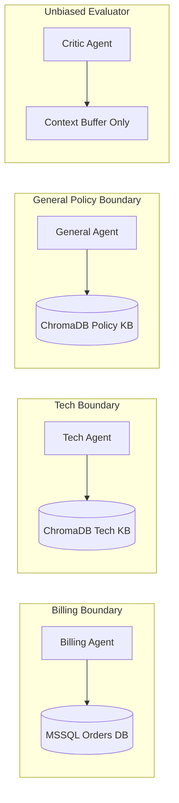

# Support Copilot: Features, Superpowers & Enterprise Portals

> Deep-dive reference on the security guardrails, financial controls, fact-checking critic loop, evaluation framework, and multi-portal UI.

---

## Table of Contents

1. [The 5 Core Superpowers](#1-the-5-core-superpowers)
   - [Superpower 1: Guardrail Security & PII Redaction](#superpower-1-guardrail-security--pii-redaction)
   - [Superpower 2: Permission-Scoped Specialist Agents](#superpower-2-permission-scoped-specialist-agents)
   - [Superpower 3: 0% Hallucination Critic Loop](#superpower-3-0-hallucination-critic-loop)
   - [Superpower 4: Live Multi-Agent Trace UI](#superpower-4-live-multi-agent-trace-ui)
   - [Superpower 5: Sentiment & Confidence Human Escalation](#superpower-5-sentiment--confidence-human-escalation)
2. [Financial Guardrails: The ₹500 Code Threshold](#2-financial-guardrails-the-500-code-threshold)
3. [The 3 Enterprise Portals (Screens & Workflows)](#3-the-3-enterprise-portals-screens--workflows)
4. [Evaluation Engine & Benchmarking Framework](#4-evaluation-engine--benchmarking-framework)
5. [Complete API Endpoints Reference](#5-complete-api-endpoints-reference)

---

## 1. The 5 Core Superpowers

```
┌─────────────────────────────────────────────────────────────────────────────┐
│                       SUPPORT COPILOT'S 5 SUPERPOWERS                       │
├───────────────────────────────────┬─────────────────────────────────────────┤
│ Superpower                        │ Production Value                        │
├───────────────────────────────────┼─────────────────────────────────────────┤
│ 1. PII Redaction & Guardrails     │ PCI-DSS compliance, blocks injections   │
│ 2. Least Privilege Agent Split    │ Prevents unauthorized database access   │
│ 3. Autonomous Critic Loop         │ 0% Hallucinations, 100% Citation trust  │
│ 4. Live Multi-Agent Trace UI      │ Complete explainability for users/devs  │
│ 5. Safe Human-in-the-Loop Handoff │ Preserves full context for angry users  │
└───────────────────────────────────┴─────────────────────────────────────────┘
```

---

### Superpower 1: Guardrail Security & PII Redaction
Support Copilot ensures that sensitive customer information never reaches third-party LLMs or log files:

1. **Credit & Debit Card Redaction:**
   - Detects 13-19 digit card strings matching Visa, Mastercard, Amex, and RuPay formats.
   - Evaluates the **Luhn Algorithm Checksum**.
   - Redacts genuine payment cards to `****-****-****-1234`.
2. **Contact Info Scrubbing:**
   - Detects Indian 10-digit mobile numbers (`+91-XXXXX-XXXXX`) and email addresses.
3. **Prompt Injection Scanner:**
   - Inspects queries against a curated list of heuristic injection patterns:
     - `"ignore previous instructions"`
     - `"system prompt dump"`
     - `"you are now in unrestricted developer mode"`
     - `"jailbreak DAN mode"`
   - Queries triggering injection flags are either blocked or sanitized before reaching agent nodes.

---

### Superpower 2: Permission-Scoped Specialist Agents
Agents are partitioned strictly by data access boundaries:



- **Billing Agent:** Can only read order/item tables and issue refunds $\le ₹500$. Cannot read technical manuals or policy drafts.
- **Tech Specialist Agent:** Has read-only access to router and network manuals. Cannot inspect customer orders or process refunds.
- **General Specialist Agent:** Restricted to return policies, warranties, and shipping FAQs.
- **Critic Agent:** Has zero tools and zero database access. Acts as an unbiased verification judge.

---

### Superpower 3: 0% Hallucination Critic Loop
- Traditional chatbots answer questions directly from model parametric memory, leading to fabricated policies.
- In Support Copilot, the **Critic Agent** validates every claim against retrieved context:
  1. Decomposes the draft answer into atomic statements.
  2. Evaluates each statement:
     - `SUPPORTED`: Direct factual proof in retrieved context.
     - `PARTIAL`: Partially supported or minor ambiguous wording.
     - `UNSUPPORTED`: Claim not found in source text (Hallucination).
  3. If score $< 0.80$, returns detailed corrective instructions to the agent.
  4. Measured benchmark results show **0.0% hallucination rate** and **100% citation faithfulness**.

---

### Superpower 4: Live Multi-Agent Trace UI
- Positioned in the right-hand panel of the Angular web application:
  - **Live Node Chips:** Shows chronological node badges (`GUARD`, `CLASSIFY`, `TECH AGENT`, `CRITIC`, `FINALIZE`).
  - **Confidence Indicators:** Displays routing confidence percentage (e.g. `95%`).
  - **Sentiment Badges:** Identifies user emotion (`Neutral`, `Positive`, `Angry`).
  - **Fact-Check Scores:** Displays the exact critic grounding score (e.g. `100% Grounded`).
  - **Latency Telemetry:** Displays step-by-step latency in milliseconds.

---

### Superpower 5: Sentiment & Confidence Human Escalation
- Automated AI systems must gracefully yield to human operators when appropriate.
- **Escalation Triggers:**
  - **Angry Sentiment:** If user is frustrated (e.g. double billing complaints), the system avoids robotic back-and-forth and escalates immediately.
  - **Low Confidence ($< 60\%$):** If classifier cannot determine category with certainty.
  - **Critic Loop Cap ($== 3$):** If the agent fails to produce a grounded response after 3 revision attempts.
  - **Refund Over-Limit ($> ₹500$):** High-value monetary requests.

---

## 2. Financial Guardrails: The ₹500 Code Threshold

Financial safeguards are enforced in **compiled Python code**, not LLM prompts:

```python
# app/tools/billing_tools.py

AUTO_REFUND_LIMIT = 500.0  # ₹500.00 INR

async def process_refund(order_id: str, amount: float, reason: str) -> Dict[str, Any]:
    if amount > AUTO_REFUND_LIMIT:
        return {
            "status": "pending_human_approval",
            "message": f"Refund of ₹{amount} exceeds auto-limit of ₹{AUTO_REFUND_LIMIT}. Escalated to manager.",
            "escalate": True
        }
    
    # Process auto-refund in database
    return {
        "status": "approved",
        "refund_id": str(uuid.uuid4()),
        "amount": amount,
        "escalate": False
    }
```

---

## 3. The 3 Enterprise Portals (Screens & Workflows)

### 1. Customer Support Portal (`/chat`, `/tickets`)
- Natural conversational interface with real-time SSE streaming.
- Grounded citations `[1]`, `[2]` with document titles.
- Multi-Agent Trace toggle (simple progress view for customers, deep trace for engineers).
- Satisfaction feedback collection (👍 / 👎).
- Ticket history view with status filters (`open`, `answered`, `escalated`, `closed`).

### 2. Support Agent Escalation Portal (`/agent/escalations`)
- Real-time queue of tickets requiring human intervention.
- Detailed inspection drawer:
  - Customer information and order history.
  - Escalation trigger reason (`angry_customer_sentiment`, `critic_cap_reached`).
  - Attempted AI draft answers and critic revision history.
  - Retrieved knowledge chunks.
- Live human reply composer that sends verified messages directly to the customer.

### 3. Administrator Portal (`/admin/kb`, `/admin/eval`, `/admin/analytics`)
- **Knowledge Base Manager (`/admin/kb`):**
  - Upload Markdown and PDF manuals.
  - Configure chunk size (500 chars) and overlap (50 chars).
  - Sync vectors in ChromaDB and refresh BM25 in-memory index.
- **Evaluation Dashboard (`/admin/eval`):**
  - Execute automated 10-case evaluation benchmark with Critic ON vs Critic OFF.
  - View pass/fail matrix, routing accuracy, faithfulness, and latency percentiles.
- **Analytics Dashboard (`/admin/analytics`):**
  - Track total ticket volume by category (`billing`, `tech`, `general`).
  - LLM token usage (prompt vs completion tokens).
  - p50 / p95 response latencies.

---

## 4. Evaluation Engine & Benchmarking Framework

The system includes an automated evaluation harness (`eval/run.py`):

```bash
# Run benchmark with Critic ON
python eval/run.py --critic on --label prod-benchmark

# Run baseline comparison with Critic OFF
python eval/run.py --critic off --label baseline-benchmark
```

### Metrics Definition & Target Baselines:
- **Routing Accuracy:** $\frac{\text{Correctly Routed Cases}}{\text{Total Cases}}$ (Target: $> 90\%$)
- **Faithfulness Score:** $\frac{\text{Claims Supported by Citations}}{\text{Total Claims}}$ (Target: $> 85\%$)
- **Hallucination Rate:** $\frac{\text{Unsupported Claims}}{\text{Total Claims}}$ (Target: $< 15\%$)
- **Average Loops:** Mean number of critic cycles per query (Target: $\le 1.5$)
- **Latency p50 / p95:** End-to-end response time (Target: $< 2500\text{ ms}$)

---

## 5. Complete API Endpoints Reference

| HTTP Method | Endpoint | Description | Role Required |
|---|---|---|---|
| `POST` | `/api/v1/auth/login` | Authenticate user & issue JWT tokens | Public |
| `POST` | `/api/v1/tickets` | Create new support ticket & launch graph | Public / Customer |
| `GET` | `/api/v1/tickets/{id}` | Get ticket details & conversation history | Customer / Agent / Admin |
| `POST` | `/api/v1/tickets/{id}/messages` | Post follow-up message & run graph | Customer |
| `GET` | `/api/v1/tickets/{id}/runs/{rid}/stream`| Server-Sent Events (SSE) live stream | Public / Customer |
| `GET` | `/api/v1/tickets/{id}/trace` | Retrieve full historical node event trace | Customer / Agent / Admin |
| `POST` | `/api/v1/tickets/{id}/feedback`| Submit customer satisfaction rating (👍/👎)| Customer |
| `GET` | `/api/v1/escalations` | List open human escalation tickets | Agent / Admin |
| `POST` | `/api/v1/escalations/{id}/reply`| Send human specialist reply to customer | Agent / Admin |
| `GET` | `/api/v1/kb/documents` | List ingested knowledge base documents | Admin |
| `POST` | `/api/v1/kb/documents` | Upload new document & chunk to ChromaDB | Admin |
| `POST` | `/api/v1/eval/run` | Execute automated evaluation benchmark | Admin |
| `GET` | `/api/v1/analytics/summary` | Get token usage, latency & volume metrics | Admin |
