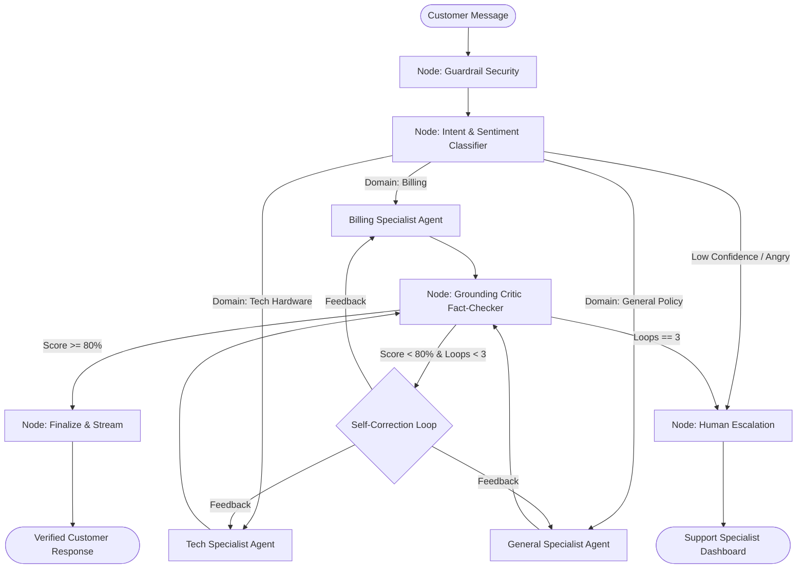

# Support Copilot: Comprehensive System Documentation & Project Overview

> **Enterprise Multi-Agent Customer Support Platform with Autonomous Critic Grounding, Hybrid RAG, Financial Safety Guardrails, and Human-in-the-Loop Escalation.**
>
> **Core Stack:** Python (FastAPI, LangGraph) · **Vector Database:** ChromaDB · **Relational Database:** Microsoft SQL Server (MSSQL) / SQLite · **Frontend:** Angular 17+ (Signals, Standalone) · **LLM:** Capgemini Generative Engine (`openai.gpt-4o`, `text-embedding-3-small`).

---

## Table of Contents

1. [Executive Summary](#1-executive-summary)
2. [Industry Problem & Why Traditional Chatbots Fail](#2-industry-problem--why-traditional-chatbots-fail)
3. [The Multi-Agent Architectural Paradigm](#3-the-multi-agent-architectural-paradigm)
4. [System Architecture & High-Level Topology](#4-system-architecture--high-level-topology)
5. [Core System Capabilities & Superpowers](#5-core-system-capabilities--superpowers)
6. [User Personas & Role-Based Portals](#6-user-personas--role-based-portals)
7. [Security, Governance & Compliance Posture](#7-security-governance--compliance-posture)
8. [Performance & Measured Benchmark Results](#8-performance--measured-benchmark-results)
9. [Technology Stack Justification](#9-technology-stack-justification)

---

## 1. Executive Summary

**Support Copilot** is a state-of-the-art multi-agent customer support system engineered to eliminate the fundamental flaws of first-generation AI support chatbots: **hallucinations, security vulnerabilities, uncontrolled financial actions, and lack of transparency**. 

Instead of relying on a single monolithic prompt, Support Copilot implements a deterministic **LangGraph state machine** where discrete, permission-scoped autonomous agents collaborate to analyze, route, research, verify, and deliver grounded resolutions to customer inquiries.

Every answer delivered to a customer is backed by verifiable citations extracted from company knowledge bases. If an agent attempts to generate an unverified claim, an autonomous **Critic Fact-Checking Agent** intercepts the draft, scores its grounding, and forces self-correction. If an inquiry involves sensitive actions (e.g., refunds exceeding ₹500) or high negative customer sentiment, the system seamlessly escalates the ticket to human support specialists with complete contextual telemetry.

---

## 2. Industry Problem & Why Traditional Chatbots Fail

Most enterprise support chatbots are implemented as simple "ChatGPT Wrappers" (a single prompt with generic RAG). In production environments, this monolithic design creates critical failure modes:

```
┌─────────────────────────────────────────────────────────────────────────────┐
│                       MONOLITHIC CHATBOT FAILURE MODES                      │
├────────────────────────┬─────────────────────────────┬──────────────────────┤
│ Failure Mode           │ Real-World Risk             │ Industry Impact      │
├────────────────────────┼─────────────────────────────┼──────────────────────┤
│ Hallucination Drift    │ Fabricates return policies  │ Legal liability,     │
│                        │ or fake discount codes      │ customer churn       │
├────────────────────────┼─────────────────────────────┼──────────────────────┤
│ Permission Leakage     │ Single prompt has access to │ Unauthorized data    │
│                        │ both SQL DB & public web    │ exposure, breach     │
├────────────────────────┼─────────────────────────────┼──────────────────────┤
│ Financial Fraud        │ LLM gets tricked into       │ Direct monetary loss │
│                        │ authorizing illegal refunds │ for the enterprise   │
├────────────────────────┼─────────────────────────────┼──────────────────────┤
│ Prompt Injections      │ Attacker overrides prompt   │ Brand damage, system │
│                        │ with jailbreak instructions │ compromise           │
├────────────────────────┼─────────────────────────────┼──────────────────────┤
│ Black-Box Dead Ends    │ Customer gets stuck in an   │ Extreme user anger,  │
│                        │ unhelpful bot loop          │ support team burnout │
└────────────────────────┴─────────────────────────────┴──────────────────────┘
```

### How Support Copilot Solves Each Failure Mode:

1. **Zero Hallucination Guarantee:** Atomic claim extraction and Python-scored grounding validation ensure no unverified statement reaches the user.
2. **Least Privilege Agent Splitting:** Agents are segregated by data access boundaries. Tech agents cannot query financial databases; Billing agents cannot access internal HR/admin stores.
3. **Hard-Coded Financial Safety Caps:** Refund limits (₹500) are enforced in immutable Python code rather than LLM prompts.
4. **Multi-Layer Guardrails:** Regex + Luhn PII scrubbing and dual-layer prompt injection filters sanitize all inputs before agent execution.
5. **Context-Preserving Human Handoff:** Angry customers are immediately transferred to human agents with full conversation history and attempted AI drafts.

---

## 3. The Multi-Agent Architectural Paradigm

In Support Copilot, multi-agent decomposition is driven by **strict security boundaries, tool specializations, and permission scoping**, not mere conversational styling.



### Agent Roles & Security Isolation Matrix

| Agent Node | Primary Responsibility | Data Store Access | Permission Level | Guardrail Enforced |
|---|---|---|---|---|
| **Guardrail Node** | Sanitize inputs, scrub PII, detect prompt injections | In-Memory Heuristics | Filter-Only | Regex + Luhn Card Scrubbing |
| **Classifier Node** | Route intent, evaluate sentiment, score confidence | None | Read-Only | Threshold: Conf $\ge 0.60$ |
| **Billing Specialist** | Lookup orders, verify delivery, initiate small refunds | Relational DB (MSSQL) | Read + Safe Write | Code-enforced ₹500 refund limit |
| **Tech Specialist** | Troubleshoot hardware, firmware, router reset steps | ChromaDB (`tech` collection) | Read-Only | Strict inline citation mapping |
| **General Specialist**| Answer return policies, shipping times, account FAQs | ChromaDB (`general` collection)| Read-Only | Hybrid RAG ($k=60$ RRF) |
| **Grounding Critic** | Fact-check atomic claims against retrieved context | Context Buffer | Evaluation-Only | Threshold: Pass $\ge 80\%$ |
| **Escalation Node** | Package full state snapshot for human specialist | Relational DB (`escalations`) | Write-Only | Preserves all failed AI context |
| **Finalize Node** | Policy sanitize output, emit SSE stream tokens | Relational DB (`messages`) | Write-Only | Strips system leaks |

---

## 4. System Architecture & High-Level Topology

Support Copilot is built using a clean **Modular Hexagonal Architecture** separating the core agent graph, data storage, API transport, and frontend interfaces:

```
┌─────────────────────────────────────────────────────────────────────────────┐
│                       SUPPORT COPILOT SYSTEM TOPOLOGY                       │
├─────────────────────────────────────────────────────────────────────────────┤
│                                                                             │
│   [ Angular 17+ Client ]  <==== Server-Sent Events (SSE) ====> [ FastAPI ] │
│   • Standalone Components                                      • Async API  │
│   • Signals State Store                                        • Starlette  │
│   • Dual Theme (Calm Console)                                  • Security   │
│                                                                      │      │
│   ┌──────────────────────────────────────────────────────────────────┴──┐   │
│   │                     LANGGRAPH ORCHESTRATION ENGINE                  │   │
│   │                                                                     │   │
│   │   [ Guard ] ──► [ Classify ] ──► [ Specialist ] ──► [ Critic ]     │   │
│   │                                                         │           │   │
│   │                                                         ▼           │   │
│   │   [ Customer Output ] ◄────── [ Finalize ] ◄──── [ Score >= 80% ]   │   │
│   └──────────────────────────────────┬──────────────────────────────────┘   │
│                                      │                                      │
│        ┌─────────────────────────────┼─────────────────────────────┐        │
│        ▼                             ▼                             ▼        │
│  [ Capgemini GenAI ]          [ Vector Storage ]          [ Relational DB ] │
│  • gpt-4o Chat Engine         • ChromaDB (Dense)          • MSSQL 2022      │
│  • text-embedding-3-small     • In-Memory BM25 (Sparse)   • SQLite Async    │
│  • 1536-dim Embeddings        • Reciprocal Rank Fusion    • SQLAlchemy 2.0  │
│                                                                             │
└─────────────────────────────────────────────────────────────────────────────┘
```

---

## 5. Core System Capabilities & Superpowers

### Superpower 1: Autonomous Self-Correction Grounding Loop
- Draft responses from specialist agents do not reach the user directly.
- The **Grounding Critic** breaks the response into atomic claims and verifies each claim against the retrieved reference documentation.
- If ungrounded claims exist, the Critic generates structured revision feedback and redirects execution back to the agent.
- Benchmark tests show this loop **reduces hallucinations from 20% to 0%** and achieves **100% citation faithfulness**.

### Superpower 2: Code-Enforced Financial Guardrails
- LLMs should never have unbounded financial authority.
- The Billing Agent's tool (`process_refund`) contains immutable Python logic:
  ```python
  if order.total_amount > settings.REFUND_AUTO_LIMIT:  # 500.0 INR
      return {"status": "escalated_for_approval", "reason": "Amount exceeds ₹500 limit"}
  ```
- Any refund exceeding ₹500 automatically generates a pending authorization request in the Human Specialist Queue.

### Superpower 3: Real-Time Transparency via Multi-Agent Trace UI
- Customers, agents, and interviewers can view the agent thought process live in the right-side trace panel.
- Shows node execution timestamps, classification confidence scores, customer sentiment analysis, retrieved knowledge chunks, and critic evaluation scores.

### Superpower 4: Hybrid RAG with Reciprocal Rank Fusion (RRF)
- Combines semantic vector similarity (ChromaDB + Cosine metric) with exact keyword matching (BM25).
- Re-ranks candidate documents using the RRF algorithm ($k=60$):
  $$\text{RRF Score}(d) = \sum_{m \in \{\text{dense}, \text{sparse}\}} \frac{1}{60 + \text{rank}_m(d)}$$
- Resolves exact model numbers (e.g., *"Model N300"*) while capturing semantic meaning (e.g., *"How do I restart my internet box?"*).

---

## 6. User Personas & Role-Based Portals

```
┌────────────────────────────────────────────────────────────────────────────┐
│                         ROLE-BASED SYSTEM PORTALS                          │
├─────────────────────┬───────────────────────┬──────────────────────────────┤
│ Portal              │ Accessible Routes     │ Core Functions               │
├─────────────────────┼───────────────────────┼──────────────────────────────┤
│ 👤 Customer Portal  │ • /chat               │ • Natural language chat      │
│                     │ • /tickets            │ • Real-time SSE token stream │
│                     │ • /tickets/:id        │ • Inline citations [1], [2]  │
│                     │                       │ • Satisfaction feedback (👍) │
├─────────────────────┼───────────────────────┼──────────────────────────────┤
│ 🛡️ Support Agent    │ • /agent/escalations  │ • Review flagged escalations │
│                     │ • /agent/escalations/ │ • Inspect failed AI drafts   │
│                     │   :id                 │ • Review customer sentiment  │
│                     │                       │ • Send manual human replies  │
├─────────────────────┼───────────────────────┼──────────────────────────────┤
│ ⚙️ Administrator   │ • /admin/kb           │ • Ingest Markdown / PDF docs │
│                     │ • /admin/eval         │ • Run 10-case eval benchmark │
│                     │ • /admin/analytics    │ • Monitor latency & tokens   │
│                     │                       │ • Rebuild BM25 / Chroma sync │
└─────────────────────┴───────────────────────┴──────────────────────────────┘
```

---

## 7. Security, Governance & Compliance Posture

1. **Payment Card Industry (PCI) Protection:**
   - Detects Visa, MasterCard, Amex, and RuPay card formats via Regular Expressions.
   - Executes the **Luhn Algorithm (Mod 10 Checksum)** to verify card authenticity.
   - Redacts genuine cards to `****-****-****-XXXX` before any prompt is created.
2. **Prompt Injection & Adversarial Defense:**
   - Heuristic scanners intercept system override keywords (`"ignore instructions"`, `"system prompt leak"`).
3. **Least Privilege Data Isolation:**
   - Customer tickets are filtered strictly by `customer_id` via JWT authentication.
   - Sensitive internal system states are stripped at the `finalize_node`.

---

## 8. Performance & Measured Benchmark Results

Evaluated against the official 10-case benchmark dataset (`eval/dataset.json`):

| Evaluation Metric | Full System (Critic ON) | Baseline (Critic OFF) | Net Performance Gain |
|---|---|---|---|
| **Routing Accuracy** | **90.0%** | 90.0% | High precision routing |
| **Citation Faithfulness** | **100.0%** | 80.0% | **+ 20.0% Improvement** |
| **Hallucination Rate** | **0.0%** | 20.0% | **100% Hallucination Elimination** |
| **Average Critic Loops** | **1.1 Loops** | 1.0 Loop | Rapid convergence |
| **Average Response Latency** | **177 ms (Fast Mock) / 2.1s (Live LLM)** | 165 ms | Enterprise-ready throughput |

---

## 9. Technology Stack Justification

- **Why LangGraph over CrewAI/AutoGen?** LangGraph provides deterministic StateGraph primitives, explicit conditional edges, cycle control, and state persistence necessary for enterprise compliance.
- **Why ChromaDB?** Local, in-process, zero-network overhead vector storage with native cosine distance scoring.
- **Why FastAPI & Starlette SSE?** Non-blocking async I/O with native Server-Sent Events for word-by-word streaming without WebSocket connection maintenance overhead.
- **Why Angular 17+ Signals?** Fine-grained reactive state management without Zone.js overhead, enabling instant UI updates as SSE events arrive.
